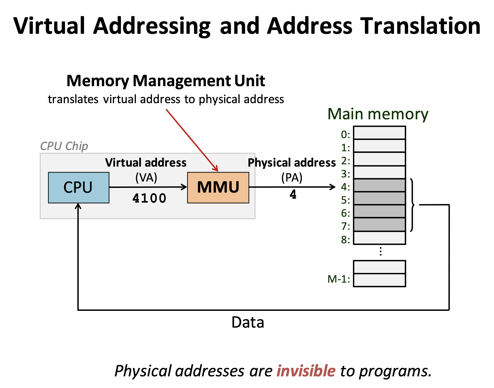
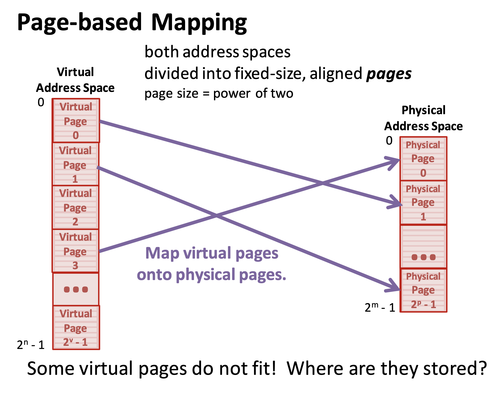

# pipex
My 7th project on 42 cursus
Notes: (some can vaguely relate to processes but to linux)
+Memory mapping : In linux kernel it is possible to map kernel address space to a user address space. This eliminates the overhead of copying user space information into the kernel space and vice versa. This can be done through a device driver and the user space device interface (/dev).
The basic unit for virtual memory manageemnt is a page, which size is usually 4K, Whenever we work with virtual memory we work with two types of addresses (virtual and physical). All CUP access (including from KERNEL space) uses virtual addresses that are translated by the MMU into physical addresses with the help of page tables. (Private virtyal memory address space managed by process) 

+Page tables : 

+MMU : (memory management unit) is used to translate virtual addresses into physical ones, is there mmu in each abstracted level? 
+memory metadata : 
+inodes : 
+tty :  
